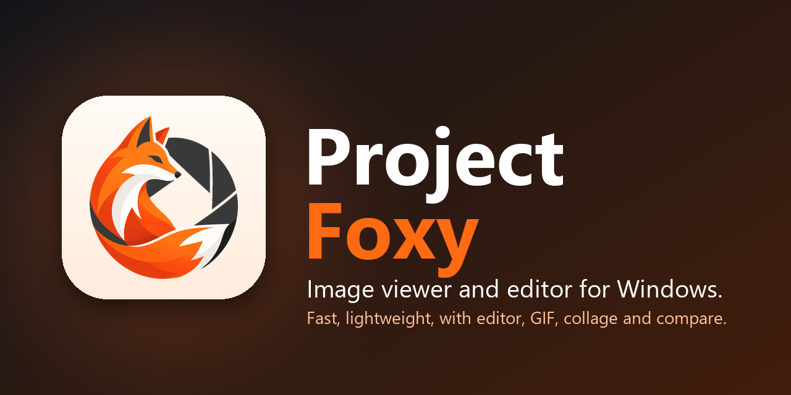
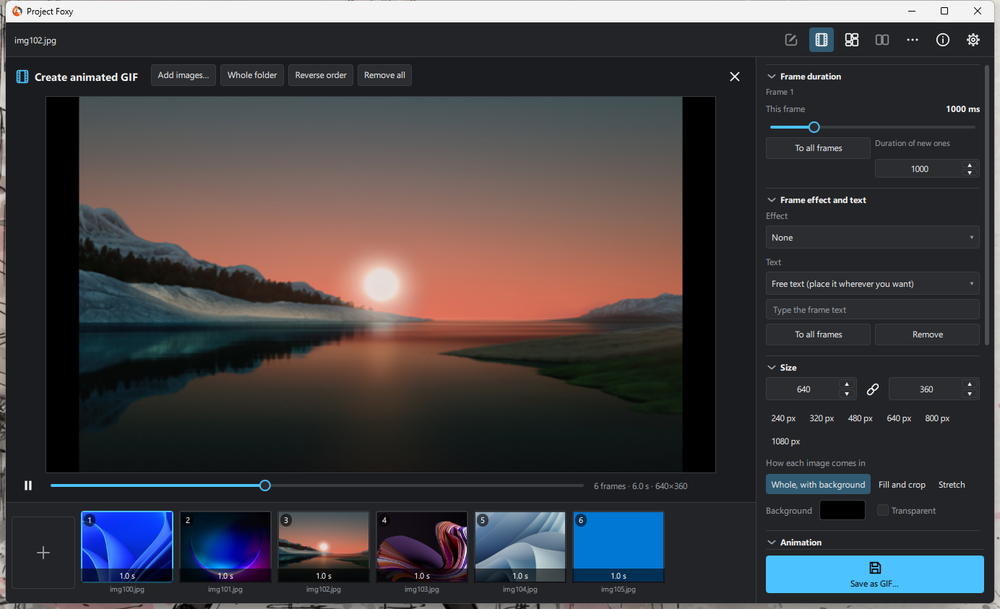
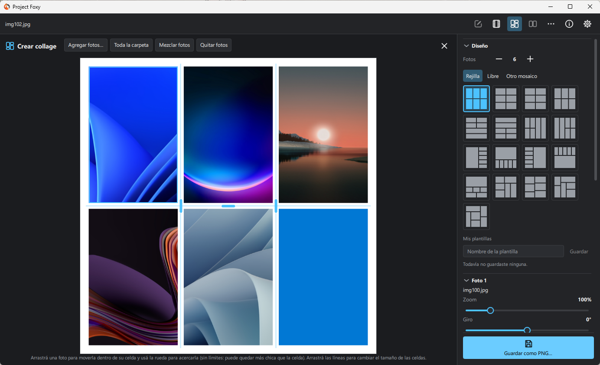
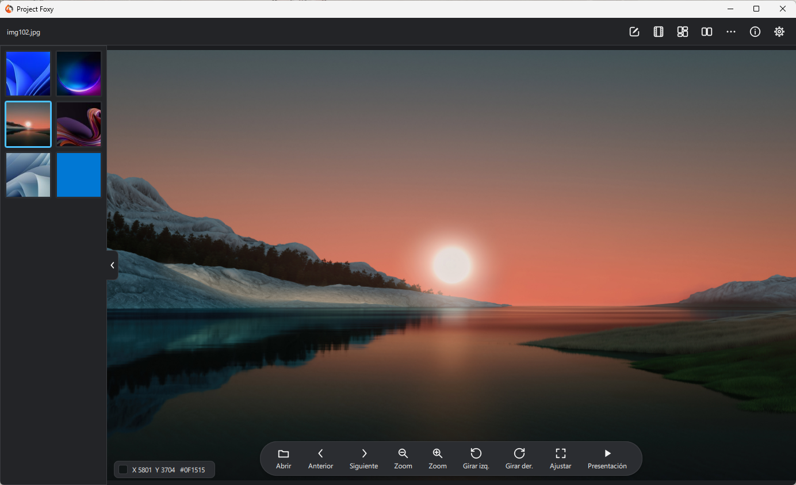
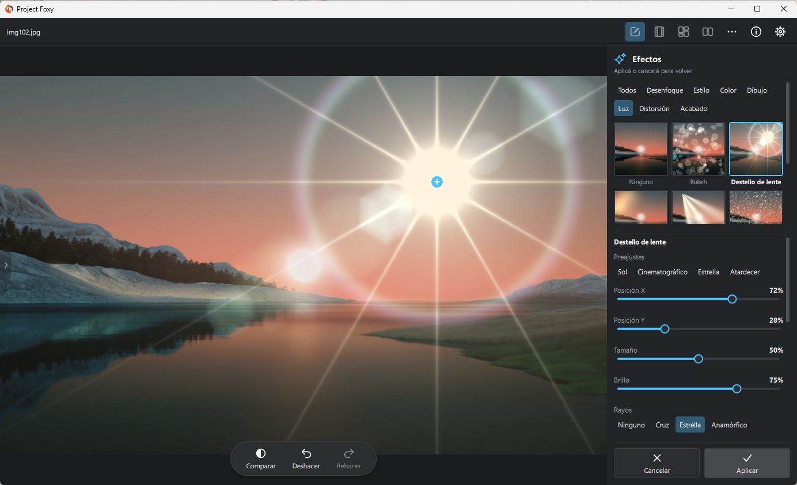
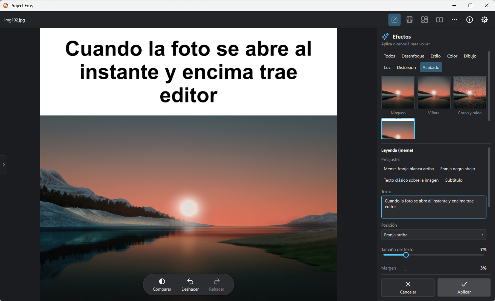
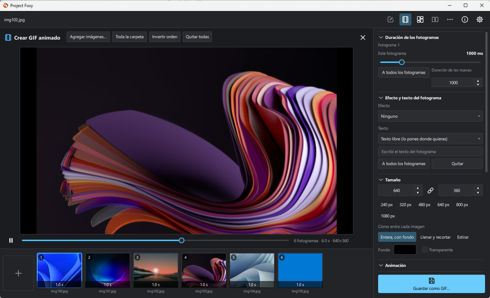

<div align="center">



# Project Foxy

**A modern, lightweight and fast image viewer for Windows, with a full photo editor built in.**

[](https://github.com/VuloB1/ProjectFoxy/releases/latest)


English · [Español](#español)

[Download](#download) · [Features](#features) · [Languages](#languages) · [Build](#build)

</div>

---

<p align="center">
  
  
</p>
<p align="center">
  
  
  
</p>

Open any photo instantly (JPEG, PNG, WebP, TIFF, HEIC, AVIF, camera RAW, animated GIFs…), browse its folder, and when
you want to touch it up there is a **complete editor**, an **animated GIF/APNG/WebP maker**, an **unlimited
collage maker**, a **compare view** for up to 10 images with linked zoom, and more. The interface speaks **six
languages** and comes with four themes: *Modern Light*, *Modern Dark* and two *Classic* ones (Windows 98 style).

## Download

Go to the [**Releases**](https://github.com/VuloB1/ProjectFoxy/releases/latest) page and pick one:

| | |
|---|---|
| **`ProjectFoxy-Setup-x.y.z.exe`** | The installer. It needs no administrator rights (it installs for your user), creates the shortcut and, if you want, adds Project Foxy to "Open with" and to Windows' *Default apps*. |
| **`ProjectFoxy-portable-x.y.z.zip`** | Portable version: unzip the **whole** folder and open `ProjectFoxy.exe`. It keeps its settings next to the program and does not touch the registry. |

Requirements: 64-bit Windows 10 or 11. Windows may warn "Windows protected your PC" because the program is not signed
yet: *More info → Run anyway*. Every file in a release comes with its SHA-256 checksum.

**Linux** (from the next release on): `ProjectFoxy-x.y.z-x86_64.AppImage`. Make it executable and run it, no installation:

```bash
chmod +x ProjectFoxy-*-x86_64.AppImage
./ProjectFoxy-*-x86_64.AppImage photo.jpg
```

It runs on any 64-bit distribution with glibc 2.35 or newer (Ubuntu 22.04+, Debian 12+, Fedora 36+, openSUSE
Tumbleweed, Arch...), on X11 and Wayland. If your system lacks FUSE 2 (`libfuse2`), run it with
`--appimage-extract-and-run`. Settings live in `~/.config/ProjectFoxy`.

## Languages

English · Español · Português · 한국어 · 中文（简体） · 日本語

The language is chosen in **Settings → Appearance → Language** and applies instantly, without restarting. By default
it follows the language of Windows. Translations live in [`i18n/strings.tsv`](i18n/strings.tsv): spotted a mistake
or want to add a language? A pull request is very welcome (see [`CONTRIBUTING.md`](CONTRIBUTING.md)).

## Features

**Viewer**
- Opens a file (dialog, drag and drop, "Open with" or the Explorer context menu) and browses its folder in natural
  order.
- Collapsible side bar with thumbnails (memory and disk cache), GPU zoom/pan, slideshow, before/after compare,
  copy/paste, desktop wallpaper, recycle bin, EXIF information with histogram.
- **Correct color**: Display P3 (iPhone) or AdobeRGB photos are converted to sRGB when opened instead of looking
  washed out; what you save is tagged as sRGB.
- Respects the **EXIF orientation** (phone photos) and opens files and folders with any name (accents, Japanese,
  Cyrillic, emoji).
- Animated GIF, APNG and WebP with real playback.
- **Compare view**: 2 to 10 images at once, arranged automatically by their shape, in a row or in a column, with
  linked zoom and pan that can be unlinked.
- **Caption (meme)**: a colored band with text above or below the picture, or the text over it with an outline.
- **Eyedropper**: hold Alt and the cursor becomes an eyedropper; a click copies the color as `#RRGGBB`.
- **Smooth zoom** (optional, in Settings) as well as the usual stepped one.
- Batch export (JPG/WebP, keeps the metadata) and batch rename; settings kept in an `.ini`.

**Formats it opens** (each one checked against a real file in the tests):
JPEG (CMYK too), PNG, WebP and TIFF (libvips; 16 bits per channel are scaled to 8) · BMP, GIF and ICO (Qt) · camera
RAW (LibRaw) · HEIC/HEIF and AVIF (libheif) · animated GIF, APNG and WebP. **Saves** PNG, JPG, BMP, TIFF and WebP, and
**creates** animated GIF, APNG and WebP.

**Safe saving**: atomic writes (a failure never leaves the original half-written), high-quality JPEG (95, no chroma
subsampling), keeps the original's EXIF, IPTC and XMP in JPEG, PNG and WebP (from HEIC/RAW it saves **and warns** that
their metadata is not kept), asks before overwriting and warns about unsaved changes when closing or opening another
image. Saving **never freezes the window** (it runs in the background, with "Saving…" / "Saved" on screen; closing
during a save waits for it to finish). It never saves while another image is loading, and "unsaved" means "the screen
does not match the file" (also after Save and Undo).

**Editor**
| Tab | What it has |
|---|---|
| Crop | Crop with handles, aspect ratios, rotate, straighten, flip · **Frame**: shape (rectangle, ellipse, hexagon, star, heart…), round, soft, cut or concave corners, outline, margin, shadow and background |
| Size | By pixels or scale, Lanczos‑3 resampling with halo-free sharpening when enlarging |
| Adjustments | 18 tone/color/detail controls, levels and per-channel curves, auto, live histogram, grain/noise (4 types) |
| Filters | 38 "looks" with thumbnails of your own photo, amount, vignette and grain |
| Effects | 43 effects in 7 groups (blur, style, color, drawing, light, distortion and finish: black and white, haze removal, cellophane, print halftone, lines, flares, bokeh, stretch, perspective…) with a preview over the whole image, their own sliders, presets and mix; "Apply" makes them an undoable step |
| Lens | Fixes the distortion, color fringes and dark corners of your lens with the Lensfun profile database (it recognizes the camera and lens from the EXIF), or by hand |
| Create (top bar) | **Animated GIF** (images with their own duration, effect and text, transitions, GIF/APNG/WebP) and **Collage** (1 to 12 photos, adjustable divider lines or free layout, photos that move and zoom without limits inside their cell, your own saved templates) |

The Adjustments and Filters preview is computed on the GPU and the saved file is generated on the CPU with the same
math, **also with semi-transparent images**; an automatic test (`test_gpu_parity`) compares them with Direct3D 11 (see
`docs/DESARROLLO.md`, section 4). **Undo/Redo** covers everything, including the Adjustments and Filters moves (a
whole slider drag is a single step).

## Stack
- C++20 · Qt 6.7 (Qt Quick/QML, RHI with Direct3D 11)
- libvips (JPEG/PNG/WebP/TIFF) · LibRaw (RAW) · libheif + libde265 + libaom (HEIC/HEIF/AVIF) · exiv2 (EXIF/IPTC/XMP
  metadata)
- CMake + Ninja + MSVC 2022, native dependencies with vcpkg

## Structure
```
├── CMakeLists.txt, CMakePresets.json, vcpkg.json
├── src/
│   ├── app/    the layer that depends on Qt Quick (`imageviewer_app` library): AppController (the front door to
│   │           QML), ImageProvider, FolderModel, ThemeManager, Translations, AppSettings, BatchExporter,
│   │           LensController, AnimStudio, CollageStudio, image providers (thumbnails, panes, previews)
│   └── core/   static library with no QML: decoders, thumbnail cache, metadata, histogram, writer,
│               edit (undo/redo stack, adjustments, looks, effects), lens, anim (GIF/APNG/WebP encoders), collage
├── qml/        window, canvas, edit panel, themed controls (App*.qml wrappers + vector icons), GPU shaders
├── i18n/       strings.tsv: every text of the program in the six languages (resources/i18n/*.json is built from it)
├── tests/      QtTest (22 programs): the core, the real AppController, CPU/GPU parity with Direct3D 11,
│               the translations, a smoke test of the real program, and fixtures (one sample of every format…)
├── installer/  Inno Setup script and portable-version notes
├── tools/      release build, banner, translation tools, context-menu .reg files
└── docs/       development and license documentation
```

`src/core` does not depend on QML: all decoding, caching and editing are tested in isolation. The QML layer only
consumes that logic through `src/app`.

## Build

Requirements: Windows, Visual Studio 2022 (or Build Tools), CMake ≥ 3.21, Ninja, Qt 6.7.3 (the validated version; the
declared minimum is 6.6) and vcpkg (`VCPKG_ROOT` set).

```bash
# copy CMakeUserPresets.json.example to CMakeUserPresets.json and adjust CMAKE_PREFIX_PATH
cmake --preset windows-release
cmake --build --preset windows-release
ctest --preset windows-release
cmake --install build/release --prefix dist     # the complete folder to ship
```

To produce the installer and the portable `.zip` in one go: `tools\Build-Release.ps1` (the installer needs
[Inno Setup 6](https://jrsoftware.org/isinfo.php)). The `windows-release` preset requires exactly Qt 6.7.3. The
`smoke_startup` test starts the real program without a visible window and fails if it dies or prints any message on
startup. `test_gpu_parity` needs a Direct3D 11 device and skips itself without one.

On **Linux** (Ubuntu 22.04 or newer; the CI does exactly this): the packages listed in the `System packages` step of
[`.github/workflows/ci.yml`](.github/workflows/ci.yml), Qt 6.7.3 (for example with
[aqtinstall](https://github.com/miurahr/aqtinstall)) and vcpkg (`VCPKG_ROOT` set):

```bash
cmake --preset linux-release -DCMAKE_PREFIX_PATH=$HOME/Qt/6.7.3/gcc_64
cmake --build --preset linux-release
ctest --preset linux-release                     # needs a display: `xvfb-run -a ctest ...` on a server
QT_ROOT_DIR=$HOME/Qt/6.7.3/gcc_64 packaging/linux/build-appimage.sh    # dist/ProjectFoxy-x.y.z-x86_64.AppImage
```

Build the AppImage on the oldest distribution you want to support: it runs on every one with a glibc at least as new
as the one it was built on. On Linux Qt picks OpenGL for the preview; `test_gpu_parity` then compares it with the CPU
result using Mesa's software renderer when there is no GPU.

## Translating

Every text of the program is written in Spanish and the Spanish text is the key of its translations
(`qsTr("…")` in QML, `core::tr("…")` in C++). To fix or add translations edit [`i18n/strings.tsv`](i18n/strings.tsv)
(one row per text: Spanish, English, Portuguese, Korean, Chinese, Japanese) and run:

```bash
python tools/i18n_tool.py check    # texts of the code missing in the table, and placeholders (%1) that do not match
python tools/i18n_tool.py build    # writes resources/i18n/<language>.json
```

## Status

- Viewer, formats, animations, themes, settings, batch, Adjustments, Filters, Effects, Lens, Frame, Compare view,
  GIF/APNG/WebP, Collage, safe saving, full undo and six languages: **done**.
- Pending: keyboard shortcuts, text and shape layers, brushes and masks, batch recipes. See `docs/DESARROLLO.md`,
  section 9.

## License

**GPL-3.0-or-later**, copyright 2026 Vulito (see [`LICENSE`](LICENSE)); it is the one consistent with exiv2 (GPL). The
licenses of the other libraries are in [`docs/LICENCIAS.md`](docs/LICENCIAS.md) and in the `licenses` folder of every
download. The lens profiles come from [Lensfun](https://lensfun.github.io/) (CC BY-SA 3.0).

## Contributing

Bugs and ideas are welcome: open an *issue* (there are templates) or read [`CONTRIBUTING.md`](CONTRIBUTING.md).

---

<a id="español"></a>

<div align="center">


# 🇪🇸 Español

**Visor de imágenes moderno, ligero y rápido para Windows, con un editor de fotos integrado.**

[English](#project-foxy) · Español

[Descargar](#descargar) · [Idiomas](#idiomas) · [Qué hace](#qué-hace) · [Compilar](#compilar)

</div>

<p align="center">
  
  
</p>
<p align="center">
  
  
  
</p>

Abre cualquier foto al instante (JPEG, PNG, WebP, TIFF, HEIC, AVIF, RAW de cámara, GIF animados…), la recorre con
su carpeta, y cuando quieres tocarla trae un **editor completo**, un **creador de GIF/APNG/WebP animados**, un
**collage sin límites**, un **comparador** de hasta 10 imágenes con zoom vinculado y más. La interfaz está en **seis idiomas** y trae cuatro temas: *Moderno Claro*, *Moderno Oscuro* y dos *Classic*
(estilo Windows 98).

## Descargar

Ve a la página de [**Releases**](https://github.com/VuloB1/ProjectFoxy/releases/latest) y elige:

| | |
|---|---|
| **`ProjectFoxy-Setup-x.y.z.exe`** | El instalador. No pide permisos de administrador (se instala para tu usuario), crea el acceso directo y, si quieres, deja a Project Foxy en «Abrir con» y en *Aplicaciones predeterminadas* de Windows. |
| **`ProjectFoxy-portable-x.y.z.zip`** | Versión portable: descomprime **toda** la carpeta y abre `ProjectFoxy.exe`. Guarda su configuración al lado del programa y no toca el registro. |

Requisitos: Windows 10 u 11 de 64 bits. Windows puede avisar con «Windows protegió su PC» porque el programa aún
no está firmado: *Más información → Ejecutar de todas formas*. Cada archivo de la release lleva su suma SHA-256.

**Linux** (desde la próxima release): `ProjectFoxy-x.y.z-x86_64.AppImage`. Dale permiso de ejecución y ábrelo, sin
instalar nada:

```bash
chmod +x ProjectFoxy-*-x86_64.AppImage
./ProjectFoxy-*-x86_64.AppImage foto.jpg
```

Funciona en cualquier distribución de 64 bits con glibc 2.35 o más nueva (Ubuntu 22.04+, Debian 12+, Fedora 36+,
openSUSE Tumbleweed, Arch...), con X11 y con Wayland. Si tu sistema no tiene FUSE 2 (`libfuse2`), ábrelo con
`--appimage-extract-and-run`. La configuración queda en `~/.config/ProjectFoxy`.

## Idiomas

Español · English · Português · 한국어 · 中文（简体） · 日本語

Se elige en **Configuración → Apariencia → Idioma** y se aplica al instante, sin reiniciar. Por defecto sigue el idioma
de Windows. Las traducciones están en [`i18n/strings.tsv`](i18n/strings.tsv): si ves un error o quieres sumar otro
idioma, un *pull request* es muy bienvenido (ver [`CONTRIBUTING.md`](CONTRIBUTING.md)).

## Qué hace

**Visor**
- Abre un archivo (diálogo, arrastrar y soltar, "Abrir con" o menú contextual del
  Explorador) y recorre su carpeta con orden natural.
- Barra lateral colapsable con miniaturas (caché en memoria y en disco),
  zoom/desplazamiento por GPU, presentación, comparar antes/después,
  copiar/pegar, fondo de escritorio, papelera, información EXIF con histograma.
- **Color correcto**: las fotos en Display P3 (iPhone) o AdobeRGB se convierten a sRGB al
  abrirlas, en lugar de verse apagadas; lo que se guarda va etiquetado como sRGB.
- Respeta la **orientación EXIF** (fotos de móvil) y abre archivos y carpetas con
  cualquier nombre (acentos, japonés, cirílico, emoji).
- GIF, APNG y WebP animados con reproducción real.
- **Comparador**: de 2 a 10 imágenes a la vez, acomodadas solas según su forma, en una fila o en una columna, con zoom y desplazamiento vinculados que se pueden desvincular.
- **Leyenda (meme)**: franja de color con texto arriba o abajo de la imagen, o el texto sobre ella con contorno.
- **Cuentagotas**: con Alt apretado el cursor pasa a cuentagotas y un clic copia el color en `#RRGGBB`.
- **Zoom suavizado** (opcional, en Configuración) además del escalonado de siempre.
- Exportación por lote (JPG/WebP, conserva los metadatos) y configuración persistida
  en un `.ini`.

**Formatos que abre** (cada uno comprobado con un archivo real en las pruebas):
JPEG (también CMYK), PNG, WebP y TIFF (libvips; los de 16 bits por canal se escalan a 8) ·
BMP, GIF e ICO (Qt) · RAW de cámara (LibRaw) · HEIC/HEIF y AVIF (libheif) · GIF, APNG y WebP animados. **Guarda** en PNG, JPG, BMP, TIFF y WebP, y **crea** GIF, APNG y WebP animados.

**Guardado seguro**: escritura atómica (un fallo nunca deja el original a medias), JPEG
de alta calidad (95, sin submuestreo de croma), conserva EXIF, IPTC y XMP del
original en JPEG, PNG y WebP (desde HEIC/RAW se guarda **avisando** de que sus
metadatos no se conservan), pide confirmación antes de sobrescribir y avisa de los cambios
sin guardar al cerrar o abrir otra imagen. El guardado **no congela la ventana** (se hace en segundo plano; con «Guardando…» y
«Guardado» en pantalla; cerrar durante el guardado espera a que termine). Nunca guarda
mientras otra imagen se está cargando, y «sin guardar» significa «la pantalla no coincide con el archivo» (también
tras Guardar y Deshacer).

**Editor**
| Pestaña | Contenido |
|---|---|
| Recortar | Recorte con tiradores, proporciones, rotar, enderezar, voltear · **Marco**: forma (rectángulo, elipse, hexágono, estrella, corazón…), esquinas redondas, suaves, cortadas o cóncavas, contorno, margen, sombra y fondo |
| Tamaño | Por píxeles o escala, remuestreo Lanczos‑3 con nitidez sin halos al ampliar |
| Ajustes | 18 controles de tono/color/detalle, niveles y curvas por canal, auto, histograma en vivo, grano/ruido (4 tipos) |
| Filtros | 38 "looks" con miniaturas de la propia foto, cantidad, viñeta y grano |
| Efectos | 43 efectos en 7 grupos (desenfoque, estilo, color, dibujo, luz, distorsión y acabado: blanco y negro, borrar niebla, celofán, semitono de imprenta, líneas, destellos, bokeh, estirar, perspectiva…) con vista previa en toda la imagen, sliders propios, preajustes y mezcla; "Aplicar" los deja como un paso deshacible |
| Lente | Corrige la distorsión, las franjas de color y las esquinas oscuras de tu objetivo con la base de perfiles de Lensfun (reconoce la cámara y el objetivo por el EXIF), o a mano |
| Crear (barra superior) | **GIF animado** (imágenes con duración, efecto y texto propios, transiciones, GIF/APNG/WebP) y **Collage** (1 a 12 fotos, líneas divisorias ajustables o diseño libre, fotos que se mueven y se acercan sin límites dentro de su celda, plantillas propias guardables) |

La vista previa de Ajustes y Filtros se calcula en la GPU y el archivo guardado
se genera en CPU con la misma matemática, **también con imágenes semitransparentes**; una
prueba automática (`test_gpu_parity`) las compara con Direct3D 11 (ver
`docs/DESARROLLO.md`, sección 4).
**Deshacer/Rehacer** cubre todo, incluidos los movimientos de Ajustes y Filtros (un
arrastre completo de un slider es un solo paso).

## Stack
- C++20 · Qt 6.7 (Qt Quick/QML, RHI con Direct3D 11)
- libvips (JPEG/PNG/WebP/TIFF) · LibRaw (RAW) · libheif + libde265 + libaom
  (HEIC/HEIF/AVIF) · exiv2 (metadatos EXIF/IPTC/XMP)
- CMake + Ninja + MSVC 2022, dependencias nativas con vcpkg

## Estructura
```
├── CMakeLists.txt, CMakePresets.json, vcpkg.json
├── src/
│   ├── app/    capa que depende de Qt Quick (biblioteca `imageviewer_app`): AppController (puerta principal
│   │           hacia QML), ImageProvider, FolderModel, ThemeManager,
│   │           AppSettings, BatchExporter, LensController, AnimStudio, CollageStudio,
│   │           proveedores de imágenes (miniaturas, paneles, vistas previas)
│   └── core/   biblioteca estática sin QML
│       ├── ImageLoader, DecoderRegistry, ThumbnailCache, MetadataReader,
│       │   Histogram, ImageWriter
│       ├── decoders/  Vips, QtImage (BMP/GIF/ICO), Raw, Heif y Animated (GIF/APNG/WebP)
│       ├── edit/      Operations, EditStack (deshacer/rehacer), AdjustMath, Looks,
│       │              Effects (por familias), Blend, Resample, ParallelRows
│       ├── lens/      LensDatabase (perfiles de Lensfun)
│       ├── anim/      codificadores de GIF, APNG y WebP animado, armado de fotogramas
│       └── collage/   dibujo y diseños del collage
├── qml/        ventana, lienzo, panel de edición, controles tematizados
│   ├── controls/  envoltorios App*.qml de cada control + iconos vectoriales
│   └── shaders/   Grade.frag y Detail.frag (vista previa en GPU)
├── tests/      QtTest (más de 440 casos): núcleo, el AppController real y la paridad CPU/GPU
│               con Direct3D 11 + prueba de humo del programa real
│               + fixtures (un archivo de ejemplo de cada formato, EXIF/XMP/IPTC, CMYK…)
├── tools/      archivos .reg del menú contextual y generador de avisos de terceros
└── docs/       documentación de desarrollo y de licencias
```

`src/core` no depende de QML: toda la decodificación, la caché y la edición se
prueban de forma aislada. La capa QML solo consume esa lógica a través de
`src/app`.

## Compilar

Requisitos: Windows, Visual Studio 2022 (o Build Tools), CMake ≥ 3.21, Ninja,
Qt 6.7.3 (la versión validada; el mínimo declarado es 6.6) y vcpkg (`VCPKG_ROOT` definido).

```bash
# copia CMakeUserPresets.json.example a CMakeUserPresets.json y ajusta CMAKE_PREFIX_PATH
cmake --preset windows-release
cmake --build --preset windows-release
ctest --preset windows-release
cmake --install build/release --prefix dist     # la carpeta completa para entregar
```

El preset `windows-release` exige exactamente Qt 6.7.3; con otra versión la configuración
falla (el de depuración solo avisa). La prueba `smoke_startup` arranca el programa real
sin ventana visible y falla si muere o escribe cualquier mensaje al arrancar. La prueba
`test_gpu_parity` necesita un dispositivo Direct3D 11 y se omite sola si no lo hay.
`tools/Test-Install.ps1` instala en una carpeta temporal y comprueba que el programa
instalado arranca sin depender de nada de esta máquina.

En **Linux** (Ubuntu 22.04 o más nuevo; el CI hace exactamente esto): los paquetes del paso `System packages` de
[`.github/workflows/ci.yml`](.github/workflows/ci.yml), Qt 6.7.3 (por ejemplo con
[aqtinstall](https://github.com/miurahr/aqtinstall)) y vcpkg (`VCPKG_ROOT` definido):

```bash
cmake --preset linux-release -DCMAKE_PREFIX_PATH=$HOME/Qt/6.7.3/gcc_64
cmake --build --preset linux-release
ctest --preset linux-release                     # necesita pantalla: `xvfb-run -a ctest ...` en un servidor
QT_ROOT_DIR=$HOME/Qt/6.7.3/gcc_64 packaging/linux/build-appimage.sh    # dist/ProjectFoxy-x.y.z-x86_64.AppImage
```

Compila el AppImage en la distribución más antigua que quieras soportar: funciona en todas las que tengan una glibc
igual o más nueva que la de la compilación. En Linux Qt usa OpenGL para la vista previa; `test_gpu_parity` la compara
con el resultado de la CPU y, si no hay GPU, usa el renderizador por software de Mesa.

`pkg-config` no hace falta instalarlo aparte: `vcpkg.json` declara `pkgconf`
como herramienta del host y `CMakeLists.txt` lo localiza solo.

## Traducir

Todos los textos del programa están escritos en español y el texto en español es la clave de sus traducciones
(`qsTr("…")` en QML, `core::tr("…")` en C++). Para corregir o agregar traducciones edita
[`i18n/strings.tsv`](i18n/strings.tsv) (una fila por texto: español, inglés, portugués, coreano, chino y japonés) y ejecuta:

```bash
python tools/i18n_tool.py check    # textos del código que faltan en la tabla y marcadores (%1) que no coinciden
python tools/i18n_tool.py build    # escribe resources/i18n/<idioma>.json
```

## Estado

- Visor, formatos, animaciones, temas, configuración, lote, Ajustes, Filtros, Efectos, Lente, Marco,
  Comparador, GIF/APNG/WebP, Collage, guardado seguro y deshacer completo: **terminados**.
- Pendientes: atajos de teclado, capas de texto y formas, pinceles y máscaras, recetas por lote.
  Ver `docs/DESARROLLO.md`, sección 9.

## Licencia

**GPL-3.0-or-later**, copyright 2026 Vulito (ver [`LICENSE`](LICENSE)). Es la coherente con exiv2 (GPL). Las
licencias de las demás librerías están en [`docs/LICENCIAS.md`](docs/LICENCIAS.md) y en la carpeta `licenses` de cada
descarga. Los perfiles de lente son de [Lensfun](https://lensfun.github.io/) (CC BY-SA 3.0).

## Contribuir

Los errores y las ideas son bienvenidos: abre un *issue* (hay plantillas) o lee [`CONTRIBUTING.md`](CONTRIBUTING.md).
